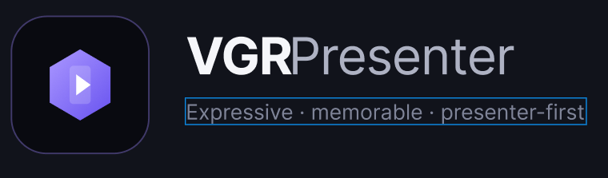

# VGRPresenter

<p align="center">
  
</p>

A presenter application for live worship services: show/slide editing, scripture
and songs, the sermon library ("The Table"), media, overlays and live outputs —
driven by a C++ presentation engine with a Qt 6 / QML interface.

Built for the operator at the desk on a Sunday morning: the Show screen watches
the live wall, the Edit screen builds slides, and one click goes live.

## Download (Windows)

Grab **`VGRPresenter-Setup-<version>.exe`** from the
[Releases](https://github.com/Librazionpc/VGRPresenter/releases) page and run
it — everything the app needs is inside the installer:

1. Run the setup exe (installs per-user, no admin prompt needed).
2. Start VGRPresenter from the Start menu or the desktop shortcut.
3. That's it — Windows 10 or newer. Your data stays in
   `%AppData%\VGR` and `%LocalAppData%\bps`, so updates and re-installs keep
   everything, and uninstalling never deletes it.

Prefer nothing installed? The **`VGRPresenter-win64.zip`** on the same
release page is a fully portable build — unzip anywhere and run
`appVGRPresenterUI.exe`.

## Quick guide

The header has three modes — **Show**, **Edit**, **Stage** — and the bottom dock
holds the content tabs: Shows, Media, Overlays, Templates, Scripture,
**The Table**, Calendar, Functions.

- **Build a show** — Edit mode → `+ New show` (or the clock panel's button).
  Add text, scripture, media and shapes to slides; pick a template; auto-size
  handles fitting. Shows save as `.vgr` documents.
- **Present** — Show mode → click slides to send them → red **GO LIVE** button
  for the live output. The monitor wall on the right shows every output live.
- **Outputs** — Settings (gear) · Outputs: screens and **NDI** sources/destinations.
  The refresh-rate setting drives the real advertised NDI frame rate.
- **Scripture** — the Scripture tab with translation picking and verse-level
  search; slides derive from your template.
- **The Table** — the sermon library. `New sermon` imports a `.txt`/`.pdf`
  (year + title come from the file name); `Add sermons folder` imports a whole
  tree with a progress bar. Notes and highlights are stored per paragraph, and
  every sermon joins the app-wide search.
- **Search everywhere** — `Ctrl+K` quick search spans scripture, sermons, songs
  and media. Type a citation (`47-0412`) to jump straight to a sermon.
- **Handy keys** — `Ctrl+1/2/3` switch modes, `F11` fullscreen, `Ctrl+K` search,
  `Ctrl+N` new show. The full list is in the logo menu → Keyboard shortcuts.

If the engine is still booting, the splash tells you — everything else stays
usable, and the app opens the moment the engine settles.

## Building from source (Windows)

Prerequisites:

- [Qt 6.11.1](https://www.qt.io/download-open-source) — the **mingw_64** build
- [MSYS2](https://www.msys2.org/) with the **ucrt64** MinGW toolchain (`gcc`, on PATH)
- CMake + Ninja (both ship inside the Qt install under `Tools/`)
- Git

```bash
cmake -S . -B build -G Ninja \
      -DCMAKE_BUILD_TYPE=Release \
      -DCMAKE_PREFIX_PATH="C:/Qt/6.11.1/mingw_64"
cmake --build build
```

Or use the repo's own tooling:

```bash
tools/dev_cycle.sh                 # stop → build → launch → health check
tools/make_portable.sh --release   # optimized portable zip into dist/
tools/make_installer.sh            # Release build + smoke test + Setup exe
tools/set_version.sh 1.0.0         # bump the version everywhere (UI reads it live)
tools/release_windows.sh 1.0.0     # version + installer/zip + GitHub release
```

The app needs Qt's DLLs on PATH to run from a dev build (`dev_cycle.sh` handles
this); only the packaged `dist/` zip is self-contained.

## Repository layout

| Path                        | What                                                                                                                                                                            |
| --------------------------- | ------------------------------------------------------------------------------------------------------------------------------------------------------------------------------- |
| `src/PresentationEngine/` | The C++ engine: kernel, modules (display, render, broadcast, library, search, project…), the platform abstraction layer (`platform/`), unit tests                            |
| `qml/`                    | The Qt Quick UI: screens (`screens/`), reusable components (`components/`), services the UI talks to (`services/` — the bridge to the engine), list models (`models/`) |
| `assets/`                 | Brand assets: app icon, resource script, lockups                                                                                                                                |
| `tools/`                  | Dev-cycle, portable packaging, version and release scripts                                                                                                                      |

## Platform status

| Platform    | State                                                           |
| ----------- | --------------------------------------------------------------- |
| Windows x64 | Shipping (portable zip)                                         |
| Linux       | Engine platform layer exists; build + packaging being validated |
| macOS       | Engine platform layer is a stub — not ready                    |

## Releases

Every release is a version tag with curated notes (new features, tweaks, bug
fixes) and the portable zip attached. See the
[releases page](https://github.com/Librazionpc/VGRPresenter/releases) —
current release: **v0.0.5**.
